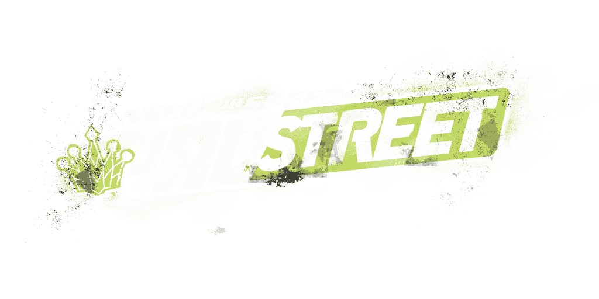

# 1) Synopsis

|                                        |                                        |
| -------------------------------------- | -------------------------------------- |
| Set Difficulty                         | 8/10                                   |
| Approximate time to master             | 25h                                    |
| Minimum numbers of playthroughs needed | 1                                      |
| Number of missable achievements        | 8                                      |
| Does difficulty affect achievements?   | Yes                                    |
| Hardest achievement of the set         | [Out of Control (25)](#out-of-control) |

Say goodbye to the streets. In [Need for Speed: ProStreet](https://retroachievements.org/game/2825) you assume the role of Ryan Cooper, a former street racer entering the world of organized track racing. As you climb the ranks of the various racing organizations, you will have to win and dominate the many Race Day events while you earn the right to challenge the Showdown King and the Kings of each individual racing discipline. Defeating all of them earns you the title of Street King.

# 2) Things to Know

- Entering any code will void all achievements, if saved it'll persist forever on that career save file and will transfer over to any other career save you make on that same alias.

- For achievements that require records to be beaten, what's valid is the original record the game starts with and not any records you may have increased. In addition, where specific tracks are required only the normal configuration of the track is valid, not the reverse.

- All 5 bosses have missable achievements related to King Assist as their events are not repeatable: [PH: The Real Showdown King], [PH: The Real Grip King], [PH: The Real Drag King], [PH: The Real Drift King], and [PH: The Real Speed King]. Make sure to select King Assist before challenging them and don't reset the game or choose a different event while doing each boss.

- Keep cars earned from Challenge Race Days with their pre-tuned blueprints intact for later achievements: [PH: When Life Gives You Lemons...], [PH: ...Make Lemonade...], and [PH: ...And Start a Lemonade Stand]. You can modify other blueprints in those cars, but don't change modes or you'll lose the pre-tuned blueprints. If you don't have enough cars with pre-tuned blueprints to enter a Showdown, you'll get locked out of the related achievement as you can only earn Challenge rewards once. As with the boss related achievements, make sure to select King Assist before starting the Race Day and don't reset the game before dominating.

# 3) Roadmap

### Stage 1: Main Story (94 points)

In this stage you will progress through the story at your own pace, while grabbing any optional or challenge achievements you want on the way. [PH: The Real Showdown King] is the only missable achievement in this section.

| Title (Points)                                         | Description                                                                       | Type          |
| ------------------------------------------------------ | --------------------------------------------------------------------------------- | ------------- |
| [D-Day (1)](#d-day)                                    | Win the race at Chicago Airfield and qualify for Battle Machine.                  | Progression   |
| [The Big Time (3)](#the-big-time)                      | Dominate Challenge: Nevada and receive a Drag car as your reward.                 | Progression   |
| [Going Global (5)](#going-global)                      | Dominate Showdown: Chicago and qualify for React Team Sessions.                   | Progression   |
| [Big in Japan (5)](#big-in-japan)                      | Dominate Challenge: Autopolis and receive a Drift car as your reward.             | Progression   |
| [On Fire (10)](#on-fire)                               | Dominate Showdown: Autopolis and qualify for Super Promotion.                     | Progression   |
| [No Limits (10)](#no-limits)                           | Dominate Challenge: Autobahnring and receive a Speed car as your reward.          | Progression   |
| [The Final Showdown (10)](#the-final-showdown)         | Dominate Showdown: Autobahnring and earn a chance to challenge The Showdown King. | Progression   |
| [My Man, Ryan Cooper! (25)](#my-man-ryan-cooper)       | Defeat Ryo Watanabe and become the new Showdown King.                             | Win Condition |
| [The Real Showdown King (25)](#the-real-showdown-king) | Defeat Ryo Watanabe in one sitting using King Assist.                             | Missable      |

### Stage 2: Optional Bosses (117 points)

In this stage you will complete Race Days belonging to the specialized racing organizations on your way to each 4 optional bosses. These bosses are not required to complete the main path but they are part of the path to 100% completion. They are unlocked by beating 10 track records in each of the 4 disciplines: Grip, Drag, Drift, and Speed. Each boss has an associated missable achievement as their events are not repeatable: [The Real Grip King (10)](#the-real-grip-king), [The Real Drag King (10)](#the-real-drag-king), [The Real Drift King (10)](#the-real-drift-king), and [The Real Speed King (10)](#the-real-speed-king).

| Title (Points)                                   | Description                                                   | Type     |
| ------------------------------------------------ | ------------------------------------------------------------- | -------- |
| [Close to the Apex (3)](#close-to-the-apex)      | Dominate your first Race Day in the G Effect Organization.    |          |
| [Ray Krieger (10)](#ray-krieger)                 | Defeat Ray Krieger and become the new Grip King.              |          |
| [The Real Grip King (10)](#the-real-grip-king)   | Defeat Ray Krieger in one sitting using King Assist.          | Missable |
| [The Perfect Shift (3)](#the-perfect-shift)      | Dominate your first Race Day in the Rogue Speed Organization. |          |
| [Karol Monroe (10)](#karol-monroe)               | Defeat Karol Monroe and become the new Drag King.             |          |
| [The Real Drag King (10)](#the-real-drag-king)   | Defeat Karol Monroe in one sitting using King Assist.         | Missable |
| [Smooth Transitions (3)](#smooth-transitions)    | Dominate your first Race Day in the Noise Bomb Organization.  |          |
| [Aki Kimura (10)](#aki-kimura)                   | Defeat Aki Kimura and become the new Drift King.              |          |
| [The Real Drift King (10)](#the-real-drift-king) | Defeat Aki Kimura in one sitting using King Assist.           | Missable |
| [Edge of Control (3)](#edge-of-control)          | Dominate your first Race Day in the Nitrocide Organization.   |          |
| [Nate Denver (10)](#nate-denver)                 | Defeat Nate Denver and become the new Speed King.             |          |
| [The Real Speed King (10)](#the-real-speed-king) | Defeat Nate Denver in one sitting using King Assist.          | Missable |
| [The Street King (25)](#the-street-king)         | Defeat all 5 Kings and become the Street King.                |          |

### Stage 3: 100% Completion (125 points)

In this stage you will complete any remaining tasks needed for 100% completion. This involves dominating every race day in addition to the requirements of the previous stages. Domination of the Race Days in the specific race disciplines organizations (G Effect, Rogue Speed, Noise Bomb and Nitrocide) also includes beating the Kings related to them.

| Title (Points)                                                         | Description                                                       | Type |
| ---------------------------------------------------------------------- | ----------------------------------------------------------------- | ---- |
| [Big Racing (5)](#big-racing)                                          | Dominate Challenge: Texas and receive a Grip car as your reward.  |      |
| [Through the Mountains (5)](#through-the-mountains)                    | Dominate Challenge: Ebisu and receive a Speed car as your reward. |      |
| [Battle Machine Domination (25)](#battle-machine-domination)           | Dominate all Race Days in the Battle Machine Organization.        |      |
| [React Team Sessions Domination (25)](#react-team-sessions-domination) | Dominate all Race Days in the React Team Sessions Organization.   |      |
| [Super Promotion Domination (25)](#super-promotion-domination)         | Dominate all Race Days in the Super Promotion Organization.       |      |
| [G Effect Domination (10)](#g-effect-domination)                       | Dominate all Race Days in the G Effect Organization.              |      |
| [Rogue Speed Domination (10)](#rogue-speed-domination)                 | Dominate all Race Days in the Rogue Speed Organization.           |      |
| [Noise Bomb Domination (10)](#noise-bomb-domination)                   | Dominate all Race Days in the Noise Bomb Organization.            |      |
| [Nitrocide Domination (10)](#nitrocide-domination)                     | Dominate all Race Days in the Nitrocide Organization.             |      |

### Stage 4: Challenges (651 points)

In this stage you will go above and beyond what the game asks from you by completing many challenges, some are mode specific, others are car specific. Some of them are simple and will probably be acquired automatically by the time you're in the later stages of the game, others can be quite difficult, so be prepared to spend some time on them. [When Life Gives You Lemons... (10)](#when-life-gives-you-lemons), [...Make Lemonade... (25)](#make-lemonade), and [...And Start a Lemonade Stand (25)](#and-start-a-lemonade-stand) are missable as you need to keep the cars earned from challenges with their pre-tuned blueprints intact.

Click on each achievement for more details.

| Title (Points)                                                                                                     | Description                                                                                                                                      | Type |
| ------------------------------------------------------------------------------------------------------------------ | ------------------------------------------------------------------------------------------------------------------------------------------------ | ---- |
| [When Life Gives You Lemons... (10)](#when-life-gives-you-lemons)                                                  | Dominate Showdown: Chicago in one sitting using King Assist and using only pre-tuned blueprints of cars that were not obtained from a King.      |      |
| [...Make Lemonade... (25)](#make-lemonade)                                                                         | Dominate Showdown: Autopolis in one sitting using King Assist and using only pre-tuned blueprints of cars that were not obtained from a King.    |      |
| [...And Start a Lemonade Stand (25)](#and-start-a-lemonade-stand)                                                  | Dominate Showdown: Autobahnring in one sitting using King Assist and using only pre-tuned blueprints of cars that were not obtained from a King. |      |
| [Almost Easy (25)](#almost-easy)                                                                                   | Dominate a Challenge Race Day in one sitting by completing at most half of the events in it using King assist.                                   |      |
| [Escape (10)](#escape)                                                                                             | Beat the record score in Showdown: Chicago.                                                                                                      |      |
| [Draw Japan (10)](#draw-japan)                                                                                     | Beat the record score in Showdown: Autopolis.                                                                                                    |      |
| [A Blast Beat (10)](#a-blast-beat)                                                                                 | Beat the record score in Showdown: Autobahnring.                                                                                                 |      |
| [Battle Machine Mastery (50)](#battle-machine-mastery)                                                             | Beat the record score in all Race Days in the Battle Machine Organization.                                                                       |      |
| [React Team Sessions Mastery (50)](#react-team-sessions-mastery)                                                   | Beat the record score in all Race Days in the React Team Sessions Organization.                                                                  |      |
| [Super Promotion Mastery (50)](#super-promotion-mastery)                                                           | Beat the record score in all Race Days in the Super Promotion Organization.                                                                      |      |
| [G Effect Mastery (25)](#g-effect-mastery)                                                                         | Beat the record score in all Race Days in the G Effect Organization.                                                                             |      |
| [Rogue Speed Mastery (25)](#rogue-speed-mastery)                                                                   | Beat the record score in all Race Days in the Rogue Speed Organization.                                                                          |      |
| [Noise Bomb Mastery (25)](#noise-bomb-mastery)                                                                     | Beat the record score in all Race Days in the Noise Bomb Organization.                                                                           |      |
| [Nitrocide Mastery (25)](#nitrocide-mastery)                                                                       | Beat the record score in all Race Days in the Nitrocide Organization.                                                                            |      |
| [Challenge Mastery: Nevada (5)](#challenge-mastery-nevada)                                                         | Beat all individual event records in Challenge: Nevada.                                                                                          |      |
| [Challenge Mastery: Texas (10)](#challenge-mastery-texas)                                                          | Beat all individual event records in Challenge: Texas.                                                                                           |      |
| [Challenge Mastery: Autopolis (10)](#challenge-mastery-autopolis)                                                  | Beat all individual event records in Challenge: Autopolis.                                                                                       |      |
| [Challenge Mastery: Ebisu (25)](#challenge-mastery-ebisu)                                                          | Beat all individual event records in Challenge: Ebisu.                                                                                           |      |
| [Challenge Mastery: Autobahnring (25)](#challenge-mastery-autobahnring)                                            | Beat all individual event records in Challenge: Autobahnring.                                                                                    |      |
| [Sliding Scale (10)](#sliding-scale)                                                                               | Score at least 100,000 points in a single Race Day.                                                                                              |      |
| [Clean Racer (2)](#clean-racer)                                                                                    | Win a Grip mode event with no damage to your car.                                                                                                |      |
| [Power Player (3)](#power-player)                                                                                  | Dominate all sectors of a Sector Shootout event at the same time.                                                                                |      |
| [Cooked to Perfection (4)](#cooked-to-perfection)                                                                  | Reach max grip bonus in a Drag mode event.                                                                                                       |      |
| [Ten Second Car (3)](#ten-second-car)                                                                              | Finish a 1/4 mile Drag race in under 10 seconds.                                                                                                 |      |
| [Eleven Second Car (10)](#eleven-second-car)                                                                       | Finish a 1/2 mile Drag race in under 11 seconds.                                                                                                 |      |
| [Watch My Feet (3)](#watch-my-feet)                                                                                | Score at least 3,000 points in a single Drift round.                                                                                             |      |
| [Steady Hands (2)](#steady-hands)                                                                                  | Win a Speed mode event with no damage to your car.                                                                                               |      |
| [Restless (10)](#restless)                                                                                         | Score at least 5,000 points on a Sector Shootout event.                                                                                          |      |
| [Granny Shifting, Not Double Clutching Like You Should (5)](#granny-shifting-not-double-clutching-like-you-should) | Finish a 1/4 mile Drag race in under 8 seconds using Clutch.                                                                                     |      |
| [More Is Enough (5)](#more-is-enough)                                                                              | Maintain a Wheelie over a full 1/4 mile (402.3 m, 1,320 ft).                                                                                     |      |
| [Fancy Footwork (10)](#fancy-footwork)                                                                             | Score at least 15,000 points on a single Drift round using King Assist.                                                                          |      |
| [Out of Control (25)](#out-of-control)                                                                             | Maintain a speed of 396 km/h (246 MPH) or higher for at least 10s in a Speed mode event on Nevada Highway and then win the event.                |      |
| [Ryan Is Gonna Be Running Three Honda Civics (4)](#ryan-is-gonna-be-running-three-honda-civics)                    | Dominate a multi-discipline Race Day to which you've brought nothing but Honda Civics.                                                           |      |
| [The Legendary Hachiroku of Ebisu (10)](#the-legendary-hachiroku-of-ebisu)                                         | Score at least 8,600 points on a single Drift round in Ebisu using a stock Toyota Corolla GTS (AE86).                                            |      |
| [Eleanor (4)](#eleanor)                                                                                            | Achieve a lap time under 60 seconds in a race on the Horse Thief Mile at Willow Springs using a Shelby GT500 '67.                                |      |
| [Twisted Chassis (3)](#twisted-chassis)                                                                            | Win a Wheelie Competition using a Dodge Charger R/T.                                                                                             |      |
| [Poster Boy (10)](#poster-boy)                                                                                     | Score at least 5,000 points on a single Drift round in Tokyo Dockyards using a Mazda RX-7 and King assist.                                       |      |
| [Homologation Special (3)](#homologation-special)                                                                  | Break a track record on a Nevada Grip mode race with a dirt section using a stock Ford Escort RS Cosworth.                                       |      |
| [Ten Minute Car (5)](#ten-minute-car)                                                                              | Finish a 1/4 mile Drag race in under 10 seconds using a Toyota Supra with no power or nitrous upgrades.                                          |      |
| [Pogo (2)](#pogo)                                                                                                  | Break a track record in any Autobahn Speed mode event using a Volkswagen Golf GTI or R32.                                                        |      |
| [Donkey Kong? (5)](#donkey-kong)                                                                                   | Score at least 10,000 points on a single Drift round using a Nissan 350Z (Z33).                                                                  |      |
| [Right Out of the Show Floor (3)](#right-out-of-the-show-floor)                                                    | Break a track record in any Tokyo Time Attack event using a stock Nissan GT-R Proto.                                                             |      |
| [Track Certified (2)](#track-certified)                                                                            | Break a track record in a Mondello Park GP Circuit Time Attack using any BMW M3.                                                                 |      |
| [Blackjack (2)](#blackjack)                                                                                        | Break a track record in any Nevada Highway Speed mode event using any Chevrolet Corvette.                                                        |      |
| [NASCAR Street Series (2)](#nascar-street-series)                                                                  | Break a track record in a Texas World Speedway Oval Circuit event using a Ford Mustang.                                                          |      |
| [Boxer Spirit (4)](#boxer-spirit)                                                                                  | Break a track record in an Ebisu Time Attack event using a Subaru Impreza WRX STI with no power or nitrous upgrades.                             |      |
| [The Fastest Car in the West (10)](#the-fastest-car-in-the-west)                                                   | Beat a lap time of 0:55.00 in a race on the GP Circuit at Willow Springs.                                                                        |      |
| [The Fastest Road in the Pacific Northwest (10)](#the-fastest-road-in-the-pacific-northwest)                       | Beat a lap time of 0:48.00 in a race on the GP Circuit at Portland International Raceway.                                                        |      |
| [Holiday in Ireland (10)](#holiday-in-ireland)                                                                     | Beat a lap time of 1:20.00 in a race on the GP Circuit at Mondello Park.                                                                         |      |
| [Super Street (10)](#super-street)                                                                                 | Beat a lap time of 1:20.00 in a race on the GP Circuit at Autopolis.                                                                             |      |
| [In the Sonoma Desert (10)](#in-the-sonoma-desert)                                                                 | Beat a lap time of 1:00.00 in a race on the GP Circuit at Infineon.                                                                              |      |
| [Slingshot, Engage (10)](#slingshot-engage)                                                                        | Beat a lap time of 0:30.00 in a race on the Oval Circuit at Texas World Speedway.                                                                |      |

# 4) Achievements

### [D-Day](https://retroachievements.org/achievement/553431)

`Win the race at Chicago Airfield and qualify for Battle Machine.` `[Progression]`

Earned upon winning the first race in Career mode.

### [The Big Time](https://retroachievements.org/achievement/553432)

`Dominate Challenge: Nevada and receive a Drag car as your reward.` `[Progression]`

Earned upon dominating Challenge: Nevada.

### [Going Global](https://retroachievements.org/achievement/553433)

`Dominate Showdown: Chicago and qualify for React Team Sessions.` `[Progression]`

Earned upon dominating Showdown: Chicago.

### [Big in Japan](https://retroachievements.org/achievement/553434)

`Dominate Challenge: Autopolis and receive a Drift car as your reward.` `[Progression]`

Earned upon dominating Challenge: Autopolis.

### [On Fire](https://retroachievements.org/achievement/553435)

`Dominate Showdown: Autopolis and qualify for Super Promotion.` `[Progression]`

Earned upon dominating Showdown: Autopolis.

### [No Limits](https://retroachievements.org/achievement/553436)

`Dominate Challenge: Autobahnring and receive a Speed car as your reward.` `[Progression]`

Earned upon dominating Challenge: Autobahnring.

### [The Final Showdown](https://retroachievements.org/achievement/553437)

`Dominate Showdown: Autobahnring and earn a chance to challenge The Showdown King.` `[Progression]`

Earned upon dominating Showdown: Autobahnring.

### [My Man, Ryan Cooper!](https://retroachievements.org/achievement/553438)

`Defeat Ryo Watanabe and become the new Showdown King.` `[Win Condition]`

Earned upon defeating Ryo Watanabe at Showdown: Tokyo.

### [The Real Showdown King](https://retroachievements.org/achievement/553439)

`Defeat Ryo Watanabe in one sitting using King Assist.` `[Missable]`

Before challenging Ryo Watanabe at the last Showdown, make sure to enable King Assist. Then, defeat him in all of his events without quitting or resetting the game.

### [Close to the Apex](https://retroachievements.org/achievement/553440)

`Dominate your first Race Day in the G Effect Organization.`

Earned upon dominating your first Race Day in the G Effect Organization after unlocking it by beating 10 Grip track records.

### [Ray Krieger](https://retroachievements.org/achievement/553441)

`Defeat Ray Krieger and become the new Grip King.`

Earned upon defeating Ray Krieger at the G Effect Willow Springs II Race Day.

### [The Real Grip King](https://retroachievements.org/achievement/553442)

`Defeat Ray Krieger in one sitting using King Assist.` `[Missable]`

Before challenging Ray Krieger, make sure to enable King Assist. Then, defeat him in all of his events without quitting or resetting the game.

### [The Perfect Shift](https://retroachievements.org/achievement/553443)

`Dominate your first Race Day in the Rogue Speed Organization.`

Earned upon dominating your first Race Day in the Rogue Speed Organization after unlocking it by beating 10 Drag track records.

### [Karol Monroe](https://retroachievements.org/achievement/553444)

`Defeat Karol Monroe and become the new Drag King.`

Earned upon defeating Karol Monroe at the Rogue Speed Infineon II Race Day.

### [The Real Drag King](https://retroachievements.org/achievement/553445)

`Defeat Karol Monroe in one sitting using King Assist.` `[Missable]`

Before challenging Karol Monroe, make sure to enable King Assist. Then, defeat her in all of her events without quitting or resetting the game.

### [Smooth Transitions](https://retroachievements.org/achievement/553446)

`Dominate your first Race Day in the Noise Bomb Organization.`

Earned upon dominating your first Race Day in the Noise Bomb Organization after unlocking it by beating 10 Drift track records.

### [Aki Kimura](https://retroachievements.org/achievement/553447)

`Defeat Aki Kimura and become the new Drift King.`

Earned upon defeating Aki Kimura at the Noise Bomb Autopolis II Race Day.

### [The Real Drift King](https://retroachievements.org/achievement/553448)

`Defeat Aki Kimura in one sitting using King Assist.` `[Missable]`

Before challenging Aki Kimura, make sure to enable King Assist. Then, defeat him in all of his events without quitting or resetting the game.

### [Edge of Control](https://retroachievements.org/achievement/553449)

`Dominate your first Race Day in the Nitrocide Organization.`

Earned upon dominating your first Race Day in the Nitrocide Organization after unlocking it by beating 10 Speed track records.

### [Nate Denver](https://retroachievements.org/achievement/553450)

`Defeat Nate Denver and become the new Speed King.`

Earned upon defeating Nate Denver at the Nitrocide Nevada Highway II Race Day.

### [The Real Speed King](https://retroachievements.org/achievement/553451)

`Defeat Nate Denver in one sitting using King Assist.` `[Missable]`

Before challenging Nate Denver, make sure to enable King Assist. Then, defeat him in all of his events without quitting or resetting the game.

### [The Street King](https://retroachievements.org/achievement/553452)

`Defeat all 5 Kings and become the Street King.`

Earned upon defeating all 5 Kings: Ryo Watanabe, Ray Krieger, Karol Monroe, Aki Kimura, and Nate Denver.

### [Big Racing](https://retroachievements.org/achievement/553453)

`Dominate Challenge: Texas and receive a Grip car as your reward.`

Earned upon dominating Challenge: Texas.

### [Through the Mountains](https://retroachievements.org/achievement/553454)

`Dominate Challenge: Ebisu and receive a Speed car as your reward.`

Earned upon dominating Challenge: Ebisu.

### [Battle Machine Domination](https://retroachievements.org/achievement/553455)

`Dominate all Race Days in the Battle Machine Organization.`

Earned upon dominating all 9 Race Days in the Battle Machine Organization.

### [React Team Sessions Domination](https://retroachievements.org/achievement/553456)

`Dominate all Race Days in the React Team Sessions Organization.`

Earned upon dominating all 11 Race Days in the React Team Sessions Organization.

### [Super Promotion Domination](https://retroachievements.org/achievement/553457)

`Dominate all Race Days in the Super Promotion Organization.`

Earned upon dominating all 13 Race Days in the Super Promotion Organization.

### [G Effect Domination](https://retroachievements.org/achievement/553458)

`Dominate all Race Days in the G Effect Organization.`

Earned upon dominating all 3 Race Days in the G Effect Organization and beating the Grip King.

### [Rogue Speed Domination](https://retroachievements.org/achievement/553459)

`Dominate all Race Days in the Rogue Speed Organization.`

Earned upon dominating all 3 Race Days in the Rogue Speed Organization and beating the Drag King.

### [Noise Bomb Domination](https://retroachievements.org/achievement/553460)

`Dominate all Race Days in the Noise Bomb Organization.`

Earned upon dominating all 3 Race Days in the Noise Bomb Organization and beating the Drift King.

### [Nitrocide Domination](https://retroachievements.org/achievement/553461)

`Dominate all Race Days in the Nitrocide Organization.`

Earned upon dominating all 3 Race Days in the Nitrocide Organization and beating the Speed King.

### [When Life Gives You Lemons...](https://retroachievements.org/achievement/553462)

`Dominate Showdown: Chicago in one sitting using King Assist and using only pre-tuned blueprints of cars that were not obtained from a King.` `[Missable]`

Pre-tuned blueprints are default setups found in cars rewarded from Challenge Race Days and from King pink slips, they cannot be modified and performance levels may vary a lot between them. The ones obtained from Kings are pretty decent in performance but ones from challenges are usually very basic.

Make sure to enable King Assist before starting the Race Day and don't reset the game before dominating.

Here's some recommended cars for each event type:

- Grip: 350Z (Z33) from Challenge: Texas
  - For the Sector Shootout event, the 240SX (S13) has a better base score and can be used instead.
- Drag: Cobalt SS from Challenge: Nevada
  - This one falls off hard after the first Showdown so the best thing you can expect is usualy 3rd place
- Drift: GTO from Challenge: Autopolis
  - Slightly better than the G35 (V35) as it maintains better speed through drifts
- Speed: Viper SRT10 from Challenge: Autobahnring
  - Has the highest top speed and acceleration. If you fall below 322 km/h (200 MPH), shift down to 4th gear to get better traction and never shift to 6th gear

### [...Make Lemonade...](https://retroachievements.org/achievement/553463)

`Dominate Showdown: Autopolis in one sitting using King Assist and using only pre-tuned blueprints of cars that were not obtained from a King.` `[Missable]`

For this one you wanna get as much as possible from the drift events. In the grip events it is possible to win both with some fighting.

See [When Life Gives You Lemons...](#when-life-gives-you-lemons) for more information and car recommendations.

### [...And Start a Lemonade Stand](https://retroachievements.org/achievement/553464)

`Dominate Showdown: Autobahnring in one sitting using King Assist and using only pre-tuned blueprints of cars that were not obtained from a King.` `[Missable]`

This one is mostly about the speed events so having the Viper SRT10 is a must. The drift events can also be cleared with decent scores using the GTO.

See [When Life Gives You Lemons...](#when-life-gives-you-lemons) for more information and car recommendations.

### [Almost Easy](https://retroachievements.org/achievement/553465)

`Dominate a Challenge Race Day in one sitting by completing at most half of the events in it using King assist.`

This can only really be done on Challenge: Nevada or Challenge: Autobahnring. In Nevada doing the 2 drag races with a time around 11.40s should do the trick. In Autobahnring doing the 2 Speed events and the Time Attack event is the best option.

As usual, make sure to enable King Assist before starting the Race Day and don't reset the game before dominating.

### [Escape](https://retroachievements.org/achievement/553466)

`Beat the record score in Showdown: Chicago.`

Record scores in Showdowns are somewhat higher than normal Race Days, but shouldn't be much harder to beat if you do well in all events.

### [Draw Japan](https://retroachievements.org/achievement/553467)

`Beat the record score in Showdown: Autopolis.`

See [Escape](#escape) for more information.

### [A Blast Beat](https://retroachievements.org/achievement/553468)

`Beat the record score in Showdown: Autobahnring.`

See [Escape](#escape) for more information.

### [Battle Machine Mastery](https://retroachievements.org/achievement/553469)

`Beat the record score in all Race Days in the Battle Machine Organization.`

Each Race Day has a preset record score to beat, they are usually quite reasonable to achieve. You can retry individual events as many times as you want until you get a good score before leaving the Race Day.

### [React Team Sessions Mastery](https://retroachievements.org/achievement/553470)

`Beat the record score in all Race Days in the React Team Sessions Organization.`

See [Battle Machine Mastery](#battle-machine-mastery) for more information.

### [Super Promotion Mastery](https://retroachievements.org/achievement/553471)

`Beat the record score in all Race Days in the Super Promotion Organization.`

See [Battle Machine Mastery](#battle-machine-mastery) for more information.

### [G Effect Mastery](https://retroachievements.org/achievement/553472)

`Beat the record score in all Race Days in the G Effect Organization.`

This also includes beating the Grip King, Ray Krieger. A normal defeat is enough to count towards this achievement, no need to worry about records for King races.

See [Battle Machine Mastery](#battle-machine-mastery) for more information.

### [Rogue Speed Mastery](https://retroachievements.org/achievement/553473)

`Beat the record score in all Race Days in the Rogue Speed Organization.`

This also includes beating the Drag King, Karol Monroe. A normal defeat is enough to count towards this achievement, no need to worry about records for King races.

See [Battle Machine Mastery](#battle-machine-mastery) for more information.

### [Noise Bomb Mastery](https://retroachievements.org/achievement/553474)

`Beat the record score in all Race Days in the Noise Bomb Organization.`

This also includes beating the Drift King, Aki Kimura. A normal defeat is enough to count towards this achievement, no need to worry about records for King races.

See [Battle Machine Mastery](#battle-machine-mastery) for more information.

### [Nitrocide Mastery](https://retroachievements.org/achievement/553475)

`Beat the record score in all Race Days in the Nitrocide Organization.`

This also includes beating the Speed King, Nate Denver. A normal defeat is enough to count towards this achievement, no need to worry about records for King races.

See [Battle Machine Mastery](#battle-machine-mastery) for more information.

### [Challenge Mastery: Nevada](https://retroachievements.org/achievement/553476)

`Beat all individual event records in Challenge: Nevada.`

Records in Challenge Race Days are usually tougher to beat because you are severely limited in what cars you can use.

The recommended cars are the same as the ones in [When Life Gives You Lemons...](#when-life-gives-you-lemons).

### [Challenge Mastery: Texas](https://retroachievements.org/achievement/553477)

`Beat all individual event records in Challenge: Texas.`

See [Challenge Mastery: Nevada](#challenge-mastery-nevada) for more information.

### [Challenge Mastery: Autopolis](https://retroachievements.org/achievement/553478)

`Beat all individual event records in Challenge: Autopolis.`

See [Challenge Mastery: Nevada](#challenge-mastery-nevada) for more information.

### [Challenge Mastery: Ebisu](https://retroachievements.org/achievement/553479)

`Beat all individual event records in Challenge: Ebisu.`

The M3 E46 is the better choice here.

See [Challenge Mastery: Nevada](#challenge-mastery-nevada) for more information.

### [Challenge Mastery: Autobahnring](https://retroachievements.org/achievement/553480)

`Beat all individual event records in Challenge: Autobahnring.`

See [Challenge Mastery: Nevada](#challenge-mastery-nevada) for more information.

### [Sliding Scale](https://retroachievements.org/achievement/553481)

`Score at least 100,000 points in a single Race Day.`

The only real path for this one is in Race Days that only have drifting events in them, as they give the highest points by far. The 2 main options are Ebisu and Autopolis in the Noise Bomb Organization. The scoring potential in Tokyo Dockyards is not quite as high.

Try to drift as much as possible in one long motion. Should be possible using King Assist but Casual Assist has a much higher effect of snapping you back into the track for easier maintenance of long drifts.

### [Clean Racer](https://retroachievements.org/achievement/553482)

`Win a Grip mode event with no damage to your car.`

Should be fairly easy to do in any Grip event if you keep it in the gray stuff.

### [Power Player](https://retroachievements.org/achievement/553483)

`Dominate all sectors of a Sector Shootout event at the same time.`

Dominating a sector depends a lot on the car and the power it outputs, if you're struggling with one specific car try lowering the power or using a different car.

General car recomendations are in [Appendix: Recommended Cars and Setups](#5-appendix-recommended-cars-and-setups).

### [Cooked to Perfection](https://retroachievements.org/achievement/553484)

`Reach max grip bonus in a Drag mode event.`

This tracks your grip bonus meter during the "heating tires" phase of drag events. To trigger this, you need to reach the maximum amount of grip bonus as tracked by the green meter. When you reach it, the message at the top of the screen that tracks checkpoints like 25%, 50% and 75% will say "Reached Maximum Grip Bonus".

The game sometimes might flash the message "Max Grip!" when you are close to the maximum at the end of the timer, but that does not count for this achievement if you haven't actually completely filled the green meter.

### [Ten Second Car](https://retroachievements.org/achievement/553485)

`Finish a 1/4 mile Drag race in under 10 seconds.`

Should be fairly easy to do with most cars that have been upgraded for drag racing.

### [Eleven Second Car](https://retroachievements.org/achievement/553486)

`Finish a 1/2 mile Drag race in under 11 seconds.`

This one requires a lot more optimization, you're gonna need a great Drag car fully upgraded for this one.

General car recomendations are in [Appendix: Recommended Cars and Setups](#5-appendix-recommended-cars-and-setups).

### [Watch My Feet](https://retroachievements.org/achievement/553487)

`Score at least 3,000 points in a single Drift round.`

Should be doable with pretty much any Drift car, including the ones gifted to you in Challenge: Autopolis.

### [Steady Hands](https://retroachievements.org/achievement/553488)

`Win a Speed mode event with no damage to your car.`

Speed events are a bit trickier than grip races in terms of car control, but this still should be your goal in any Speed event.

### [Restless](https://retroachievements.org/achievement/553489)

`Score at least 5,000 points on a Sector Shootout event.`

This one needs a good car and good management of sector points, you need to make sure not to go to hard in the first few laps so you can keep breaking the records you set.

General car recomendations are in [Appendix: Recommended Cars and Setups](#5-appendix-recommended-cars-and-setups).

### [Granny Shifting, Not Double Clutching Like You Should](https://retroachievements.org/achievement/553490)

`Finish a 1/4 mile Drag race in under 8 seconds using Clutch.`

Remember, you can always shift higher as long as you use the clutch. And don't use you nitrous too soon.

### [More Is Enough](https://retroachievements.org/achievement/553491)

`Maintain a Wheelie over a full 1/4 mile (402.3 m, 1,320 ft).`

Maintaining a wheelie is all about power and shifting correctly. You want to use a car upgraded with enough power and a Tier 3 Suspension and use nitrous when the front end starts to go down.

General car recomendations are in [Appendix: Recommended Cars and Setups](#5-appendix-recommended-cars-and-setups).

### [Fancy Footwork](https://retroachievements.org/achievement/553492)

`Score at least 15,000 points on a single Drift round using King Assist.`

King Assist doesn't have as much advantage in keeping cars on track over long drifts. Good tracks to try this on are in Ebisu, Willow Springs, Autobahnring, and Autopolis.

General car recomendations are in [Appendix: Recommended Cars and Setups](#5-appendix-recommended-cars-and-setups).

### [Out of Control](https://retroachievements.org/achievement/553493)

`Maintain a speed of 396 km/h (246 MPH) or higher for at least 10s in a Speed mode event on Nevada Highway and then win the event.`

This one will require a top tier Speed car as well as some patience.

A quirk of the PS2 version of this game is that above 395 km/h (245 MPH) all steering is lost, so you need to line up the car at the right spot as you're not gonna be able to turn.

The best place to do this is on the long straight at Nevada Highway A. Line up the car as soon as possible after the corner and then use nitrous, there should be just enough time after the 10 seconds to slow down and prepare for the corner ahead.

General car recomendations are in [Appendix: Recommended Cars and Setups](#5-appendix-recommended-cars-and-setups).

### [Ryan Is Gonna Be Running Three Honda Civics](https://retroachievements.org/achievement/553494)

`Dominate a multi-discipline Race Day to which you've brought nothing but Honda Civics.`

With Spoon engines, T66 turbos with NOS, and a MoTeC system exhaust.

### [The Legendary Hachiroku of Ebisu](https://retroachievements.org/achievement/553495)

`Score at least 8,600 points on a single Drift round in Ebisu using a stock Toyota Corolla GTS (AE86).`

The AE86 is a very good drift car even in stock form. Should be possible with King Assist but Casual Assist is easier to get higher scores.

### [Eleanor](https://retroachievements.org/achievement/553496)

`Achieve a lap time under 60 seconds in a race on the Horse Thief Mile at Willow Springs using a Shelby GT500 '67.`

Should be fairly simple with tier 3 upgrades and some practice. The car can misbehave a lot if you push it too hard in corners, so try to be smooth with your inputs. And make sure to use Nitrous when you can clearly see ahead.

### [Twisted Chassis](https://retroachievements.org/achievement/553497)

`Win a Wheelie Competition using a Dodge Charger R/T.`

On green, go for it.

### [Poster Boy](https://retroachievements.org/achievement/553498)

`Score at least 5,000 points on a single Drift round in Tokyo Dockyards using a Mazda RX-7 and King assist.`

The RX-7 is a great drift car, but scoring 5,000 points in Tokyo Dockyards can be tough as the track is not very smooth.

### [Homologation Special](https://retroachievements.org/achievement/553499)

`Break a track record on a Nevada Grip mode race with a dirt section using a stock Ford Escort RS Cosworth.`

The event to do this without much trouble is the Sector Shootout in Nevada Highway II (Battle Machine).

### [Ten Minute Car](https://retroachievements.org/achievement/553500)

`Finish a 1/4 mile Drag race in under 10 seconds using a Toyota Supra with no power or nitrous upgrades.`

Or you can push it across the finish line, or tow it.

### [Pogo](https://retroachievements.org/achievement/553501)

`Break a track record in any Autobahn Speed mode event using a Volkswagen Golf GTI or R32.`

There's something in the air.

### [Donkey Kong?](https://retroachievements.org/achievement/553502)

`Score at least 10,000 points on a single Drift round using a Nissan 350Z (Z33).`

Drift? What do you mean Drift?

### [Right Out of the Show Floor](https://retroachievements.org/achievement/553503)

`Break a track record in any Tokyo Time Attack event using a stock Nissan GT-R Proto.`

This is possible in the Tokyo Race Days at React Team Sessions, or even against Ryo in Showdown: Tokyo.

### [Track Certified](https://retroachievements.org/achievement/553504)

`Break a track record in a Mondello Park GP Circuit Time Attack using any BMW M3.`

The event to do this on is the Time Attack in the G Effect Mondello Park Race Day.

### [Blackjack](https://retroachievements.org/achievement/553505)

`Break a track record in any Nevada Highway Speed mode event using any Chevrolet Corvette.`

The corvette is a bit unstable over the elevation changes, so try to keep it wheels down as much as possible.

### [NASCAR Street Series](https://retroachievements.org/achievement/553506)

`Break a track record in a Texas World Speedway Oval Circuit event using a Ford Mustang.`

Just turn left.

### [Boxer Spirit](https://retroachievements.org/achievement/553507)

`Break a track record in an Ebisu Time Attack event using a Subaru Impreza WRX STI with no power or nitrous upgrades.`

The event to do this on is the Time Attack in the Super Promotion Ebisu Race Day.

The only upgrades allowed are suspension and tires... and also brakes but who needs them?

### [The Fastest Car in the West](https://retroachievements.org/achievement/553508)

`Beat a lap time of 0:55.00 in a race on the GP Circuit at Willow Springs.`

The Big Willow is a fast track, but be careful as the corners are deceptively tricky. The last corner can be done flat out if you find the right line.

### [The Fastest Road in the Pacific Northwest](https://retroachievements.org/achievement/553509)

`Beat a lap time of 0:48.00 in a race on the GP Circuit at Portland International Raceway.`

You can cut a lot of corners through the grass here, just make sure not to overshoot that last corner.

### [Holiday in Ireland](https://retroachievements.org/achievement/553510)

`Beat a lap time of 1:20.00 in a race on the GP Circuit at Mondello Park.`

This is a very technical track, smoother is faster here.

### [Super Street](https://retroachievements.org/achievement/553511)

`Beat a lap time of 1:20.00 in a race on the GP Circuit at Autopolis.`

This track is a lot about finding the right lines through the fast corners, you can push a lot harder than you think here.

### [In the Sonoma Desert](https://retroachievements.org/achievement/553512)

`Beat a lap time of 1:00.00 in a race on the GP Circuit at Infineon.`

Finding the right lines and cutting through the corners helps here, just be careful not to lose too much speed in the desert sand.

### [Slingshot, Engage](https://retroachievements.org/achievement/553513)

`Beat a lap time of 0:30.00 in a race on the Oval Circuit at Texas World Speedway.`

You need to maintain top speed basically around the whole oval, use nitrous in the corners to keep your speed up.

# 5) Appendix: Recommended Cars and Setups

### Grip

- Best car: Porsche 911 Turbo

You can improve on this basic setup by upgrading the turbo or using Stage 4 parts, but don't upgrade the engine as the stock one is the best for the 911 Turbo. Do note that the more power upgrades you install, the less score potential you will have as the target times will lower significantly.

Drivetrain tuned to max out at 395 km/h while using nitrous, in speeds over that all steering is lost. You can apply this setup to other cars but the drivetrain will need to be adjusted in a case by case basis.

The numbers in the Tunes column refer to how many "ticks" of the sliders to move from the center (0) position, numbers are listed from top to bottom and bold numbers refer to which sliders are unlocked by that specific part. Positive numbers mean moving the slider to the right, negative numbers mean moving it to the left.

| Part       | Stage            | Price      | Tunes                                                                                            |
| ---------- | ---------------- | ---------- | ------------------------------------------------------------------------------------------------ |
| 911 Turbo  | 3                | 122,000    | N/A                                                                                              |
| Drivetrain | 2[^1]            | 13,950[^1] | 0 0 0 0 0 4 (Drivetrain section)                                                                 |
| Turbo      | 3                | 22,900     | 0 **10** **10** 10 10 (Engine section)                                                           |
| Suspension | 3                | 29,200     | **-10** **10** **-10** **10** **-10** **10** **-10** **-10** **10** -10 -10 (Suspension section) |
| Tires      | 3                | 19,100     | -10 10 -10 10 -10 10 -10 -10 10 **-10** **-10** (Suspension section)                             |
| NOS        | 3                | 26,700     | 0 10 10 **10** **10** (Engine section)                                                           |
| Body       | Stock Autosculpt | 0          | 0%                                                                                               |
| Total      | N/A              | 233,850    | N/A                                                                                              |

[^1]: Install Stage 2 drivetrain, tune, then revert back to stock and the tuning will apply to the stock drivetrain, which has a better speed limit and can save you a bit of cash as well.

### Drift

- Best car: Chevrolet Camaro SS

- Honorable mentions: Mazda RX-7, Nissan 350Z (Z33) and Toyota Corolla GTS (AE86)

Drifting is all about power to maintain slides over long sections, anything that doesn't increase power is not necessary.

Nitrous is optional but doesn't add much.

| Part                 | Stage | Price   | Tunes                             |
| -------------------- | ----- | ------- | --------------------------------- |
| Camaro SS            | 1     | 40,000  | N/A                               |
| Engine               | 3     | 47,250  | **10** 10 10 (Engine section)     |
| Supercharger (Roots) | 3     | 18,900  | 10 **10** **10** (Engine section) |
| Total                | N/A   | 106,150 | N/A                               |

### Drag

- Best car: Chevrolet Camaro SS

- Honorable mention: Toyota Supra

The main thing is increasing traction with the suspension and tires, as well as maximizing nitrous. Engine and forced induction make you faster but also decrease your score potential as the target times will lower significantly.

Make sure to use Stage 2 suspension to avoid excessive wheeling.

| Part       | Stage | Price   | Tunes                                                                            |
| ---------- | ----- | ------- | -------------------------------------------------------------------------------- |
| Camaro SS  | 1     | 40,000  | N/A                                                                              |
| Drivetrain | 3     | 20,500  | -10 10 10 10 5 10 (Drivetrain section)                                           |
| Suspension | 2     | 14,200  | **8** **8** **8** **8** **8** **8** **8** **8** **8** 10 10 (Suspension section) |
| Tires      | 3     | 14,900  | 8 8 8 8 8 8 8 8 8 **10** **10** (Suspension section)                             |
| NOS        | 3     | 22,050  | 0 0 0 **10** **10** (Engine section)                                             |
| Total      | N/A   | 111,650 | N/A                                                                              |

For Wheeling Competitions you can use this setup instead. Parts can be applied to pretty much any rear wheel drive car and do decently well. The starter 240SX (S13) works if you don't want to buy a car just for this.

| Part       | Stage | Price   | Tunes                                                                              |
| ---------- | ----- | ------- | ---------------------------------------------------------------------------------- |
| Engine     | 3     | 45,000  | N/A                                                                                |
| Turbo      | 3     | 18,000  | N/A                                                                                |
| Suspension | 3     | 23,000  | **0** **-10** **0** **-10** **0** **-10** **0** **0** **-10** (Suspension section) |
| Tires      | 3     | 14,200  | N/A                                                                                |
| NOS        | 3     | 22,050  | N/A                                                                                |
| Spoiler    | 403   | 6,000   | 100%                                                                               |
| Total      | N/A   | 122,250 | N/A                                                                                |

### Speed

- Best car: Porsche 911 Turbo

This is basically the same setup as the [Grip](#grip) one, with some key differences in the ride height and body.

| Part       | Stage | Price      | Tunes                                                                                           |
| ---------- | ----- | ---------- | ----------------------------------------------------------------------------------------------- |
| 911 Turbo  | 3     | 122,000    | N/A                                                                                             |
| Drivetrain | 2[^1] | 13,950[^1] | 0 0 0 0 0 4 (Drivetrain section)                                                                |
| Turbo      | 3     | 22,900     | 0 **10** **10** 10 10 (Engine section)                                                          |
| Suspension | 3     | 29,200     | **-10** **10** **-10** **10** **-10** **10** **10** **-10** **10** -10 -10 (Suspension section) |
| Tires      | 3     | 19,100     | -10 10 -10 10 -10 10 10 -10 10 **-10** **-10** (Suspension section)                             |
| NOS        | 3     | 26,700     | 0 10 10 **10** **10** (Engine section)                                                          |
| Body       | Wide  | 15,000     | 100%                                                                                            |
| Total      | N/A   | 248,850    | N/A                                                                                             |

[^1]: Install Stage 2 drivetrain, tune, then revert back to stock and the tuning will apply to the stock drivetrain, which has a better speed limit and can save you a bit of cash as well.
